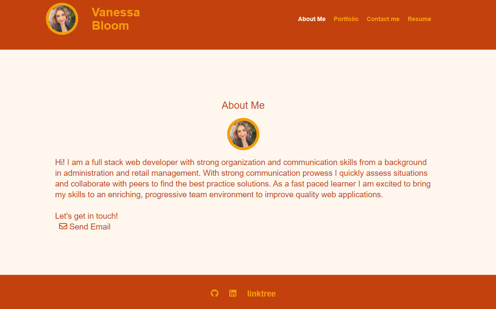

# 20-React-Portfolio

## Description:

Being a web developer means being part of a community. I need a place to share my projects not only if I'm applying for jobs or working as a freelancer but also so that I can share my work with fellow developers and collaborate on future projects. Now that I've completed multiple projects, I am to create a portfolio, using my new React skills to help be set apart from other developers whose portfolios don’t use the latest technologies.

## User Setup:

To use this at home, in your terminal run the following commands to invoke the application:
`npm i` to install packages,
then `npm run start` starts the live server.

## User Story

```md
AS AN employer looking for candidates with experience building single-page applications
I WANT to view a potential employee's deployed React portfolio of work samples
SO THAT I can assess whether they're a good candidate for an open position
```

## Screenshots:



## Links:

- GitHub repo: https://github.com/NessJade96/20-React-Portfolio
- Deploy: https://nessjade96.github.io/20-React-Portfolio/

## planning notes:

1. Go through the criteria

- Research styling theme and have a concept idea for mobile, tablet, and desktop.
- Plain HTML and CSS styling created before transferring to React app.
- Setup React, src code etc. Client and Server.
- Move the plain html into react components so they conditionally render.
- Finalise app and deploy.

## Commit notes:

1. Write my planning notes, folder setup, and create readme.md

2. Started on vanilla HTML and CSS using Tailwind.

3. Created mobile about me, commit to test on my mobile.

4. All responsive styling for About Me page done

5. Responsive styling for Portfolio page

6. fixed a few responsive errors on Portfolio page.

7. Finished the responsive CSS styling and HTML content. Next I will move onto turning this into React.

8. Today I got the gitLab criteria so I was able to create react app and ensure I had all the correct versions in my package.json. Set up React components and pages, and rendered the plain html to the page in React.

9. I Got the css displaying by changing react app version to 5.0.1 from 4.0.1 in the package.json. Set up React pages to conditionally render depending on what nav bar link is selected and imported tailwind styling.

10. Moved assets into src folder, changed the fa-links and my profile img links to render with React.

11. Imported the project images to the project component and changed the parent div in the project export function. Got the project components rendering from an array of projet information.

12. Added the form validation on the Contact Me form and to highlight the navigation text when active on that page.

Thank you, Vanessa Bloom <(^.^)>
